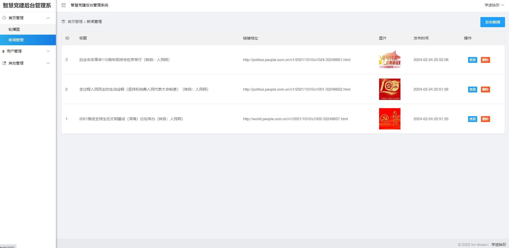
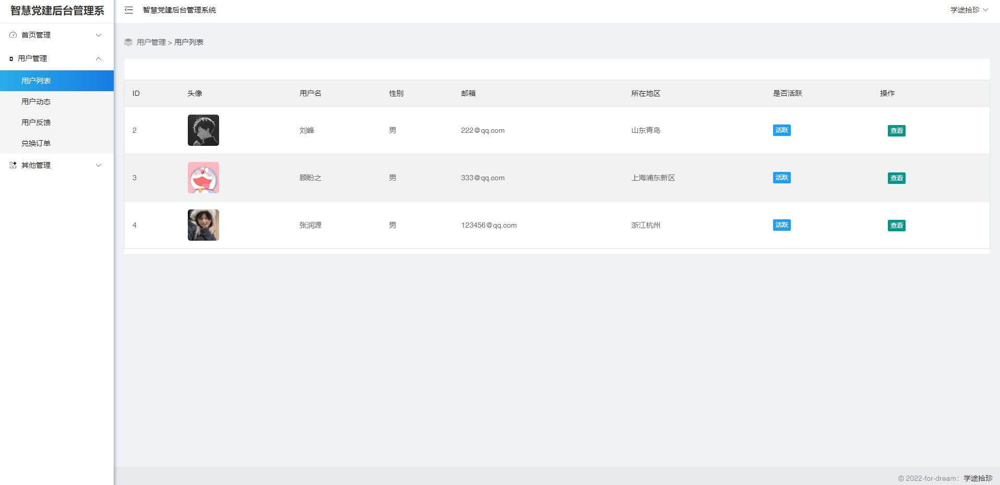
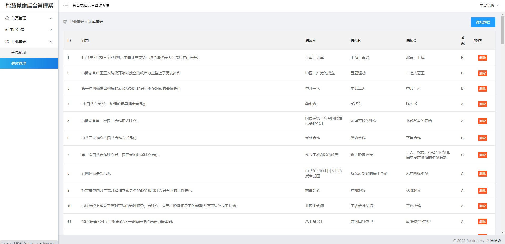
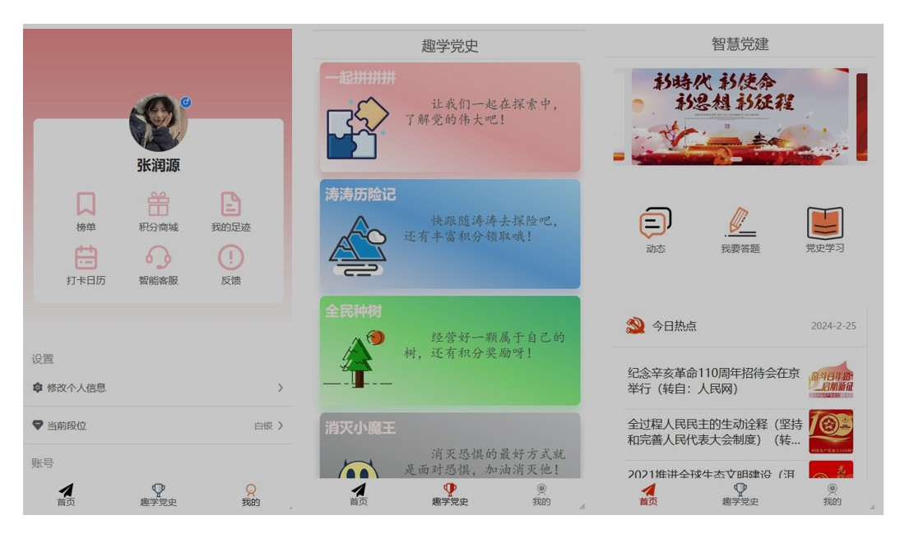
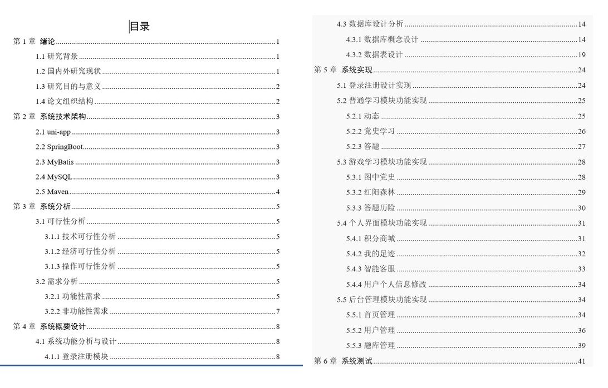

 **郑重声明：项目经过本地测试，确保可以运行， 可以用于学习和毕业设计参考~** 

**扫码 >> 源码商城 获取** 

#### 1.项目介绍

- 技术栈+环境：SpringBoot+thymeleaf+uniapp+IDEA +Navicat+MySQL

功能介绍：

- 后端功能：首页管理（轮播图、通知公告、新闻管理）、用户管理（用户信息、用户反馈、用户订单、用户动态）、其他管理（题库管理、任务管理）
- 移动端：学习模块、游戏学习模块、打卡签到、积分商城、问题咨询等

 **内附较为规范的项目说明文档~ 本项目仅供学习参考~**
 
#### 2.本地部署
##### 2.1 后端启动
- 创建数据库，导入项目中的dangjian.sql
- 打开IDEA，导入项目cyrobot-api，修改 src/main/resources/application.properties 下的数据库连接
- 下载项目提供的素材，如果不修改后端项目其他配置，请将素材放在 C:\\dangjian\\news\\，如果自定义路径，修改 application.properties 下的config.directory-path=自定义路径
- 启动项目，http://localhost:8090  管理员账号/密码 ： admin/admin

##### 2.2 移动端启动
- 通过HbuilderX,导入项目cyrobot-uni
- 按照需求，启动H5或者小程序，以H5为例，http://localhost:8080 管理员账号/密码 ： 123456@qq.com/123456

#### 3.项目部分截图

